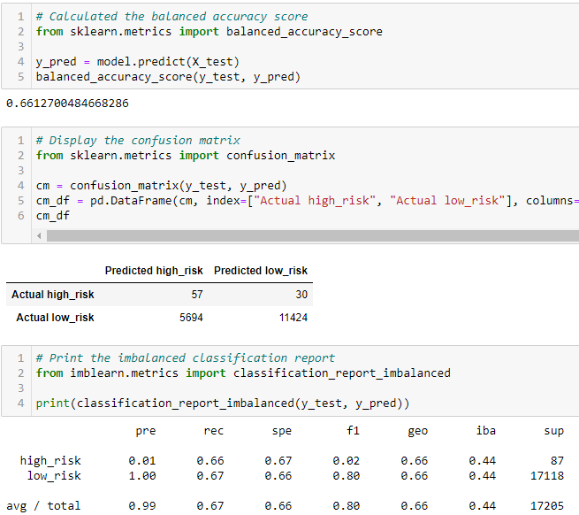
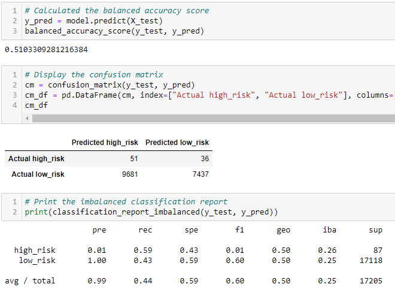
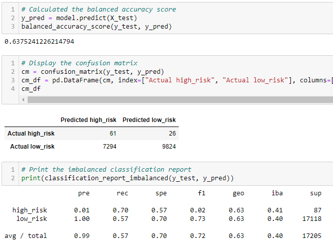
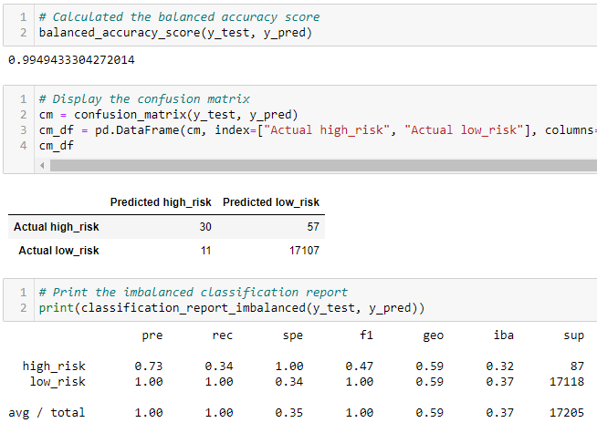
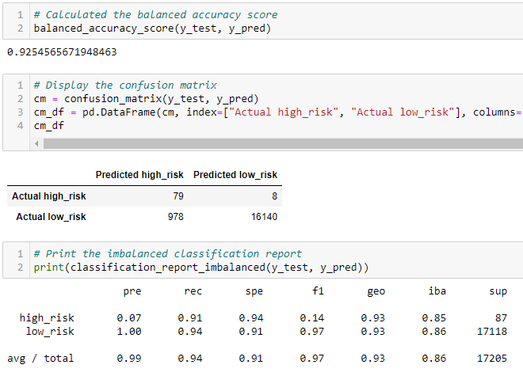

# 17_Credit_Risk_Analysis
 
## Overview
The purpose of this analysis to find the best machine learning model to predict credit risks which can be used to approve or deny a loan application. To do so, we are going to put 6 machine learning models to the test and see which model will generate the best result. 

## Results
### 1. Random Oversampling

### 2. SMOTE Oversampling

### 3. Undersampling

### 4. Combination (Oversampling and undersampling) sampling

### 5. Balanced Random Forest

### 6. 

## Summary
